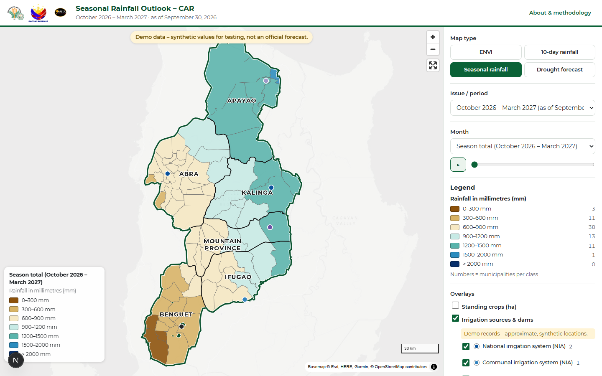

# CAR Agri-Climate Portal

The CAR Agri-Climate Portal is a web system for the Department of Agriculture – Regional Field Office, Cordillera
Administrative Region (DA-RFO-CAR), AMIA Program. It has two parts:

- **Public dashboard:** published maps of the El Niño Vulnerability Index (ENVI), the 10-day and seasonal rainfall
  forecasts (mm) and the drought forecast for the 77 municipalities of CAR. It has crop and irrigation overlays,
  an archive, downloads and share links.
- **Admin workspace:** upload → validate → preview → edit text → generate print-ready exports → publish.
  - Exports are the map images: every map gets a print-ready PNG (400 dpi) and a PDF, plus one ZIP of all of them.
    ENVI also gets its presentation (5760×3240) and A4 poster (450 dpi), each as PNG and PDF. Standing crops can be added as proportional circles
    (seasonal rainfall, drought and ENVI), with a circle legend.
  - Print maps follow the DA-RFO-CAR sample layouts in `sample data/`. The 10-day forecast has one map per
    day plus the 10-day total.
- **Photo mode** on the dashboard shows the finished map images with the recommendations (the infographic for
  ENVI).



| Document | Contents |
|---|---|
| [docs/ARCHITECTURE.md](docs/ARCHITECTURE.md) | Architecture, data model, screens, answers to §12, milestone status |
| [docs/ADMIN_GUIDE.md](docs/ADMIN_GUIDE.md) | Step-by-step guide for editors and administrators |
| [PROMPT_CAR_AgriClimate_Portal.md](PROMPT_CAR_AgriClimate_Portal.md) | The original requirements |

## Repository layout

```
web/        Next.js 15 + TypeScript + MapLibre GL – dashboard, admin workspace, API routes (deploy: Vercel)
worker/     Python FastAPI render worker – validation, products, exports (deploy: Docker with QGIS LTR)
  agriclimate/envi/     the ENVI prototype (Elnino-vul-index), ported unchanged apart from paths
  agriclimate/products/ ENVI, 10-day rainfall, seasonal rainfall, drought, crops and irrigation layers
  agriclimate/rainfall_feed.py   10-day rainfall feed (Cordillera weather API)
  agriclimate/pagasa_seasonal.py seasonal rainfall from PAGASA's published tables (CAR rows, OCR)
  agriclimate/droughtcaster.py   DroughtCaster fetcher interface (+ manual upload fallback)
  data/gis, data/gis_template    CAR boundaries (EPSG:4326) and the DA QGIS print templates
  scripts/              build_reference, build_glyphs, build_seed_sql, build_demo, make_demo_samples
supabase/   migrations/0001_init.sql (PostGIS schema + RLS + storage buckets), seed.sql
sample data/sample input/        DA-RFO-CAR sample inputs (ENVI)
docs/       architecture, admin guide, screenshots
```

## Run it locally

Requirements:
- Python 3.11+ and Node 20+.
- **PostgreSQL 17** installed (default `C:/Program Files/PostgreSQL/17`; set `PG_HOME` otherwise). It is used
  only for its binaries; the installed service and its password are not touched.
- Optional: QGIS 3.x, so ENVI maps are rendered with the official `.qgz` layout.

**1. Local database (PostgreSQL + PostGIS)**

```bash
cd web
npm install
npm run db:setup     # once: portable copy of PostgreSQL 17 + PostGIS 3.6 in <repo>/.localdb (no admin rights)
npm run db:start     # runs on localhost:54329 (stop with npm run db:stop)
npm run db:reset     # schema + seed (77 municipalities, boundaries, legends) + demo products + admin user
```

`db:reset` loads the same `supabase/migrations` and `supabase/seed.sql` that production uses.
`supabase/local/compat.sql` stands in for Supabase's `auth`/`storage` schemas. It creates the admin
**admin@example.com / admin-local-123**; change it with `LOCALDB_ADMIN_EMAIL` / `LOCALDB_ADMIN_PASSWORD`.

- Add more users with `npm run db:user -- someone@da.gov.ph <password> editor` (or `admin`).
- Open psql with the command printed by `node scripts/localdb.mjs psql`.
- Run `db:reset` again whenever you want a clean database.
- After pulling changes that add database migrations, run `npm run db:migrate` (`node dev.mjs` does it for you).
- After rebuilding the demo (`python -m scripts.build_demo`), run `npm run db:demo`. It refreshes only the demo
  products and keeps your own work.

**2. Worker**

```bash
cd worker
python -m venv .venv
.venv/Scripts/python -m pip install -r requirements.txt        # Windows (Linux/macOS: .venv/bin/python)
set WORKER_TOKEN=dev-worker-token-1234567890                    # PowerShell: $env:WORKER_TOKEN="..."
.venv/Scripts/python -m uvicorn agriclimate.api:app --port 8001
```

**3. Web**

```bash
cd web
copy .env.example .env.local     # keep DATABASE_URL, set WORKER_TOKEN (same as above) and a 32+ character SESSION_SECRET
npm run dev                      # http://localhost:3000 – admin at /admin
```

**Day to day: one command** (from the repo root, after the one-time steps above):

```bash
node dev.mjs        # starts the database (if needed), the worker (:8001) and the web app (:3000); Ctrl+C stops them
```

The web app picks its data back end from the environment:

| Back end | When | Data | Logins |
|---|---|---|---|
| Supabase | `NEXT_PUBLIC_SUPABASE_*` set | Supabase Postgres + Storage | Supabase Auth |
| PostgreSQL | `DATABASE_URL` set | local (or self-hosted) PostgreSQL + PostGIS; files in `web/.data/` | users in the database (scrypt hashes, roles in `profiles`) |
| Files | neither | bundled demo data + `web/.data/db.json` | one admin from `DEV_ADMIN_*` (development only) |

> **Demo data.** ENVI and drought use the DA-RFO-CAR sample inputs. The 10-day rainfall is a real snapshot of the
> feed (Oct 5–14, 2026). The **seasonal rainfall and irrigation demo data are synthetic**, and the dashboard says so
> in a banner. Rebuild the demo with `python -m scripts.build_demo` (in `worker/`), then `npm run db:reset`.

## Tests

```bash
cd worker && .venv/Scripts/python -m pytest      # name matching (77 names + variants), normalization, weights,
                                                  # equal/quantile/Jenks, rainfall classes at the breaks, templates,
                                                  # label report (83 labels, 0 overlaps), API, feed, ENVI acceptance
cd web && npm test                                # share links, formatting, crop classes
cd web && npm run typecheck
# end-to-end, one run per product (worker + web running):
cd web && E2E_EMAIL=admin@example.com E2E_PASSWORD=admin-local-123 node scripts/e2e.mjs
```

## Environment variables

**web/** (Vercel → Project → Settings → Environment Variables)

| Variable | Needed | Purpose |
|---|---|---|
| `NEXT_PUBLIC_SUPABASE_URL`, `NEXT_PUBLIC_SUPABASE_ANON_KEY` (or `NEXT_PUBLIC_SUPABASE_PUBLISHABLE_KEY`) | production | Supabase project (public read through RLS) |
| `SUPABASE_SERVICE_ROLE_KEY` | production | Server-only writes after the role check. Never exposed to the browser. |
| `WORKER_URL`, `WORKER_TOKEN` | yes | Private render worker URL and shared secret |
| `SESSION_SECRET` | yes | 32+ characters; signs preview payloads (and local sessions) |
| `CRON_SECRET` | production | Protects `/api/cron/rainfall-feed` (Vercel Cron sends it) |
| `R2_ACCOUNT_ID`, `R2_ACCESS_KEY_ID`, `R2_SECRET_ACCESS_KEY` | optional | Cloudflare R2 file storage instead of Supabase Storage (uploads, exports) |
| `R2_BUCKET`, `R2_PUBLIC_BUCKET`, `R2_PUBLIC_URL` | with R2 | Private bucket (default `amia-car-maps`), public bucket (default `amia-car-maps-public`, public access on) and its public URL |
| `DATABASE_URL` | local / self-hosted | PostgreSQL + PostGIS instead of Supabase (e.g. the local dev database) |
| `DEV_ADMIN_EMAIL`, `DEV_ADMIN_PASSWORD` | no-database mode only | Single admin login without any database |

**worker/**

| Variable | Needed | Purpose |
|---|---|---|
| `WORKER_TOKEN` | yes | Same value as in web |
| `SUPABASE_URL`, `SUPABASE_SERVICE_ROLE_KEY` | production | Upload exports to the private `exports` bucket |
| `R2_ACCOUNT_ID`, `R2_ACCESS_KEY_ID`, `R2_SECRET_ACCESS_KEY`, `R2_BUCKET` | optional | Upload exports to Cloudflare R2 (`exports/<version>/…`) instead of Supabase Storage |
| `EXPORTS_BUCKET` | no | Default `exports` |
| `OUTPUT_DIR` | no | Working folder for jobs (default `worker/outputs`) |
| `RAINFALL_FEED_URL` | no | Default `https://cordillera-weather.onrender.com/api/cordillera/full/` |
| `DROUGHTCASTER_URL` | no | Table in the drought template format, once a source is confirmed |
| `PAGASA_SEASONAL_URL` | no | Default `https://www.pagasa.dost.gov.ph/climate/climate-prediction/seasonal-forecast` (seasonal forecast tables, read with OCR) |
| `QGIS_PYTHON` | no | PyQGIS launcher, if QGIS is not found automatically |

## Deployment

1. **Database (Supabase).**
   - Create a project.
   - Run the migrations in order (`supabase/migrations/0001_init.sql`, `0002_crop_colors.sql`), then
     `supabase/seed.sql` (SQL editor, or `supabase db push`).
     PostGIS must be enabled.
   - Create the staff users in Auth.
   - For each user, insert a `profiles` row with role `editor` or `admin`.
2. **Worker (container host).**
   - Build the image: `docker build -t amia-car-maps-worker worker/`.
   - Run it on Cloud Run, Render, Fly or a VPS with `WORKER_TOKEN`, `SUPABASE_URL` and
     `SUPABASE_SERVICE_ROLE_KEY`.
   - Give it at least 2 GB of RAM and keep it private (only the web app calls it).
   - The image sets `QT_QPA_PLATFORM=offscreen` and `QT_QPA_FONTDIR` and installs Montserrat for PyQGIS.
3. **Web (Vercel).**
   - Import the repository with **Root Directory = `web`** and set the variables above.
   - `vercel.json` schedules the daily rainfall-feed job (22:00 UTC = 06:00 Asia/Manila).

Regenerating reference assets after a boundary change (in `worker/`):

```bash
python -m scripts.build_reference   # gazetteer.csv + web/public/geo/*.geojson (checks the 1 MB budget)
python -m scripts.build_seed_sql    # supabase/seed.sql
python -m scripts.build_glyphs      # Montserrat glyphs for map labels (needs scipy)
```

## Credits

Boundaries: DA-RFO-CAR. Forecasts: DOST-PAGASA. 10-day feed: Cordillera weather API. Basemaps: © Esri, HERE,
Garmin, Maxar; © OpenStreetMap contributors; © OpenTopoMap. Font: Montserrat (SIL Open Font License, bundled).
